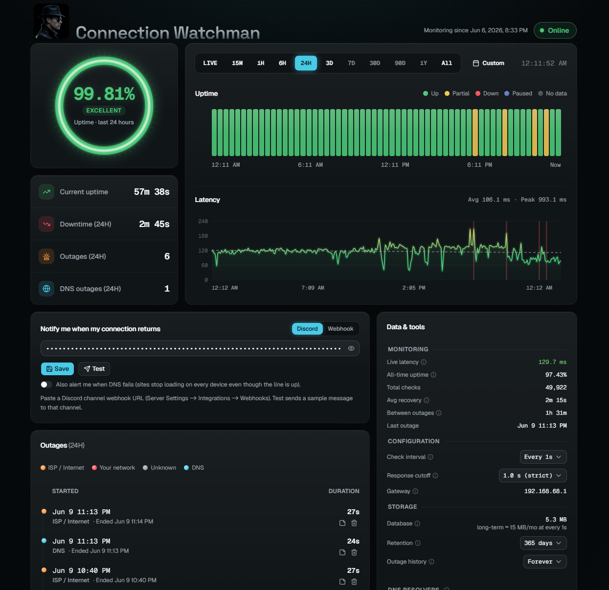
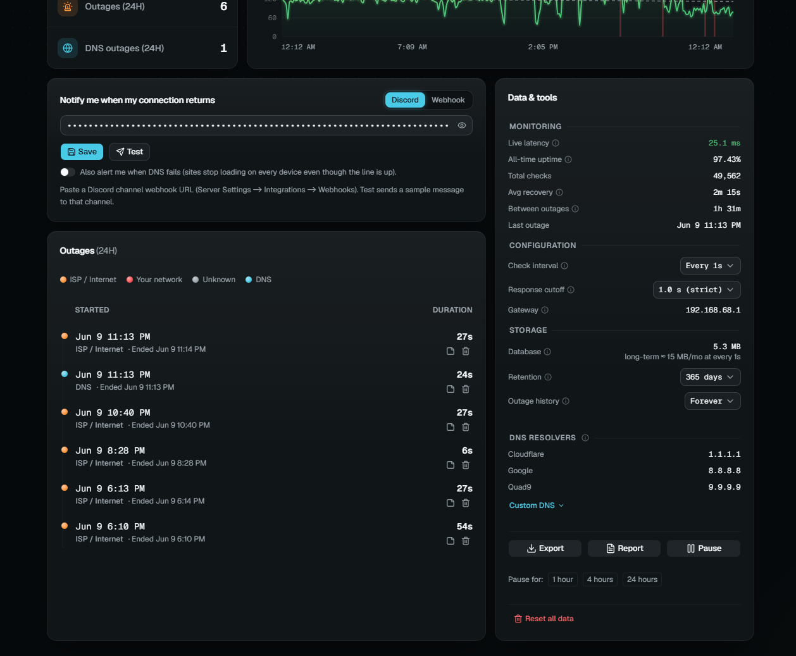
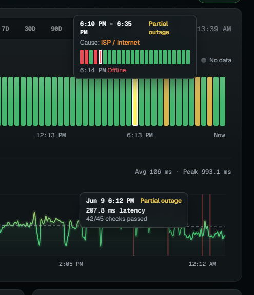

# Connection Watchman

**Self-hosted internet uptime monitor: log every connection drop, see who to blame, and hand your ISP the evidence.**

Connection Watchman runs 24/7 on any always-on machine (a Raspberry Pi is perfect), logs
every internet connectivity check to SQLite, and serves a live, mobile-friendly network
monitoring dashboard showing how often, and why, your connection drops. Built for holding
a flaky ISP accountable: every internet outage is logged with its cause, duration, and
exact timestamp, so you can back a support ticket or refund claim with hard data instead
of "it feels slow."

- **Zero dependencies.** Pure Python 3 standard library. Nothing to `pip install`, no Docker, no cloud account.
- **Works offline.** The dashboard ships its own assets (no CDN), so it loads during an outage.
- **Survives reboots.** Runs as two auto-restarting services (systemd / launchd / Scheduled Tasks).
- **Blames the right party.** Each outage is classified ISP / your network / DNS by probing your router when the line drops.
- **ISP-ready evidence.** A printable outage report and CSV export of every check and outage.

## Screenshots



*Availability gauge, uptime timeline, and a latency chart colored green to red by speed, for any range (a LIVE rolling view through all-time, or a single day).*



*Discord / webhook recovery notifications, the per-range outage log with causes, and the settings / export / pause tools.*



*Hover any moment to see the cause, the per-check breakdown, and the latency behind it.*

## Install

One command installs the monitor + dashboard as always-on services that start on boot.

**Linux / macOS:**

```bash
curl -fsSL https://raw.githubusercontent.com/noahbeanie/connection-watchman/main/install.sh | bash
```

**Windows** (admin PowerShell):

```powershell
irm https://raw.githubusercontent.com/noahbeanie/connection-watchman/main/install.ps1 | iex
```

The installer prints your dashboard URL. From other devices on the LAN use
`http://<hostname>.local:8080`. The port (8080, or the next free one) is fixed at install.

Requires Python 3 (present on macOS/Linux; the Windows installer fetches it via `winget`).
Uninstall with `uninstall.sh` / `uninstall.ps1`; your `uptime.db` is left in place.

The monitor only records while the host is awake. If the machine sleeps, that span shows as
grey "no data" (excluded from uptime, never counted as downtime) and resumes on wake, so run it
on a device that stays on for continuous coverage.

## How it works

Every interval (default 15s) the monitor runs a connectivity check and, separately, a DNS check.

**Connectivity** (the uptime score): TCP-connect to Cloudflare, Google, and Quad9 (`1.1.1.1`,
`8.8.8.8`, `9.9.9.9`) on ports 443 and 53. Up if any answers. A failed check is retried over a
few seconds before counting as down, so a single dropped packet is never an outage. A target
must also answer within the **response cutoff** (dashboard setting, default 1s), so a
reachable-but-crawling link counts as down. TCP-connect is used over ICMP because it needs no
root and isn't rate-limited. Latency is the connect that answered.

**Speed** (optional, off by default): every few hours a speed test measures real download /
upload throughput and ping against Cloudflare's speed endpoints (speed.cloudflare.com) — the
same idea as speedtest.net, still pure stdlib. Download uses one full-rate stream (the endpoint
rejects concurrent downloads, and one stream saturates the host's link); upload uses several
parallel streams (one TCP stream can't fill a fast uplink). It runs
*between* connectivity checks, so its deliberate link saturation can never register as an outage
or a latency spike. Each test moves real data (up to a configurable cap per direction), which is
why it's opt-in: enable and tune it from the dashboard's Speed panel.

**DNS** is checked separately (only while the line is up): several unrelated well-known names are
resolved via the system resolver, then directly against public resolvers. DNS counts as down only
when every name fails on every path, so one flaky forwarder or one zone's bad day is never logged
as your outage. A confirmed DNS failure means no usable internet on any device, so it counts as
downtime, recorded as its own kind so you can tell a DNS outage apart from a line drop.

Each outage stores its exact start/end and a **cause**, found by probing the LAN gateway only
when connectivity fails. The recorded cause is the one that **dominated** the outage by time, so
power-cycling your router for a minute during a long ISP outage doesn't relabel it as your fault:

| Cause | Meaning |
|-------|---------|
| `local`   | The router/LAN is unreachable: your equipment or this machine. |
| `isp`     | The router is fine, the internet isn't: your ISP / WAN. |
| `unknown` | Couldn't determine (e.g. gateway IP unknown). |

**Availability** = `(monitored - downtime) / monitored`, where downtime is connectivity outages
plus confirmed DNS outages. Monitoring gaps (reboots, pauses, sleep) count as neither up nor down,
so they never inflate or deflate the number. Outage history is exact, not bucket-estimated.

## Dashboard

- Radial **uptime gauge** for the selected range, graded Excellent to Poor.
- **Latency chart** colored green to red by speed, with bands marking outages (red), no-data (grey), and paused (blue).
- **Status-page tracker**: per-slice up / partial / down / no-data; hover for cause and latency.
- **KPI tiles**: current uptime streak, downtime, outage count, and DNS outages.
- **Speed panel**: download / upload / ping over time for the range (failed tests marked on the
  baseline), a run-now button, and the schedule + data-cap settings.
- **Outage log** for the range (paginated), each entry labeled by kind (ISP, your network, DNS).
- **Range presets**: a LIVE rolling two-minute view (refreshed every second), then a ladder
  from 15 minutes to a year plus All, and a custom date range or single day.
- **Printable report** to hand to your ISP.
- **Data & tools**: DB size, check interval / retention / response cutoff, notifications, custom
  targets, CSV export, pause, and a guarded reset.

## Notifications (optional)

Under **Data & tools → Notify me when my connection returns**, add a webhook to get pinged when
the internet comes back, with the downtime and cause. (A recovery alert is always deliverable; a
"you're down now" alert can't be sent from a single box while it's offline.)

- **Discord**: a channel webhook URL.
- **Webhook**: any endpoint; receives `{"title", "message"}` as JSON.

Hit **Test** to send a sample.

## Speed tests (optional)

The **Speed** panel tracks what you're actually getting for what you pay for. Turn it on by
picking a schedule (every 4h to daily); each run measures download, upload, and ping against
`speed.cloudflare.com`, and results chart over any range —
so a line that's slowly degrading, or only slow every evening, becomes visible the same way
outages are. **Test now** runs a one-off reading anytime (works with scheduling off).

Two knobs, both on the panel:

- **Test every** — how often. The panel shows the worst-case monthly data use for the
  current settings (e.g. every 8h at a 100 MB cap ≤ ~18 GB/month).
- **Data cap** — the most a test may move per direction. Bigger caps read fast lines more
  accurately (more of the test runs beyond TCP slow start); smaller caps suit metered plans.
  Tests are also time-bounded (~8s per direction), so slow lines use far less than the cap.

A test saturates the link for ~20 seconds on purpose. It runs between connectivity checks,
so it never shows up as a latency spike or an outage. Failed attempts are recorded and shown
too (red dots on the chart baseline), and everything exports to CSV alongside checks and
outages.

**Optional Ookla engine:** if the official [Speedtest CLI](https://www.speedtest.net/apps/cli)
(`speedtest`) is installed on the box, the monitor uses it automatically — speedtest.net's own
servers and native multi-connection engine (saturates gigabit+ links), plus **jitter and packet
loss** per test. Note that Ookla ignores the data cap: its tests adapt to the line, roughly
1–2 GB per direction on fast links. Without the binary, the built-in zero-dependency engine
above is used; if an Ookla run fails outright, the monitor falls back to it for that run.

## Custom targets (optional)

"Up" means any target answered. Defaults are Cloudflare / Google / Quad9 on ports 443 and 53.
Under **Data & tools → Targets**, swap in your own `host:port` list (e.g. to also watch a
specific service). Picked up within a cycle.

## Running alongside a VPN

An always-on VPN's policy routing can force the probe through the tunnel, so the monitor measures
the VPN path instead of your real link and misses outages your other devices see. To test the
**direct** path, set `UPTIME_FWMARK` to your VPN's bypass firewall mark so probe sockets skip the
tunnel (needs `CAP_NET_ADMIN`):

```bash
sudo mkdir -p /etc/systemd/system/uptime-monitor.service.d
printf '[Service]\nAmbientCapabilities=CAP_NET_ADMIN\nEnvironment=UPTIME_FWMARK=0xYOURMARK\n' \
  | sudo tee /etc/systemd/system/uptime-monitor.service.d/override.conf
sudo systemctl daemon-reload && sudo systemctl restart uptime-monitor
```

Find the mark with `ip rule show` (the `fwmark ... lookup <table>` rule your VPN adds). Your
other traffic stays on the VPN.

## Files

| File | What it does |
|------|--------------|
| `monitor.py`   | Logging daemon: probes, classifies causes, writes `uptime.db`. |
| `dashboard.py` | Web server: reads the DB, serves the dashboard + JSON API. |
| `web/`         | Built dashboard UI (bundled, offline-capable), served by `dashboard.py`. |
| `ui/`          | Dashboard UI source (Vite + React + TypeScript). |
| `install.sh` / `install.ps1` | Install the always-on services. |

## Storage

Storage is tiered so a fast check interval doesn't balloon the database. The last 2 days keep
every check at full resolution (where LIVE / 15-minute zooming happens). Older **healthy** rows
are thinned hourly to one per 15 s; rows recording a failure are **never** thinned, so outage
evidence keeps full fidelity forever. Long-term growth therefore stays near the 15 s rate
(about 6 MB/month, measured) even at 1 s checks, and rows past the retention setting are
trimmed entirely.
Outage and event history is kept forever, as are speed-test results (a few tiny rows per day).
Tune with `UPTIME_COMPACT_AFTER_DAYS` (0 disables thinning) and `UPTIME_COMPACT_GRID` (seconds).
