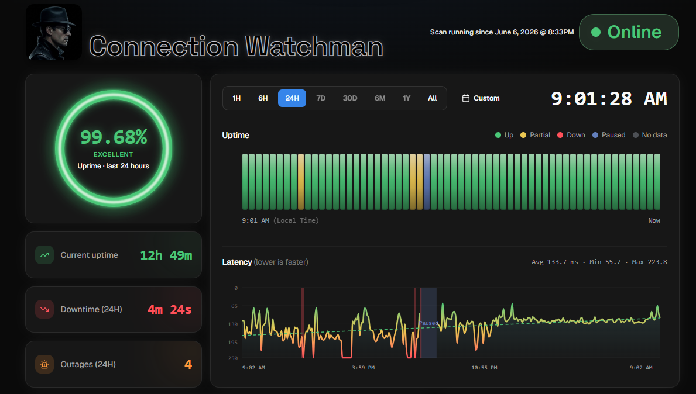
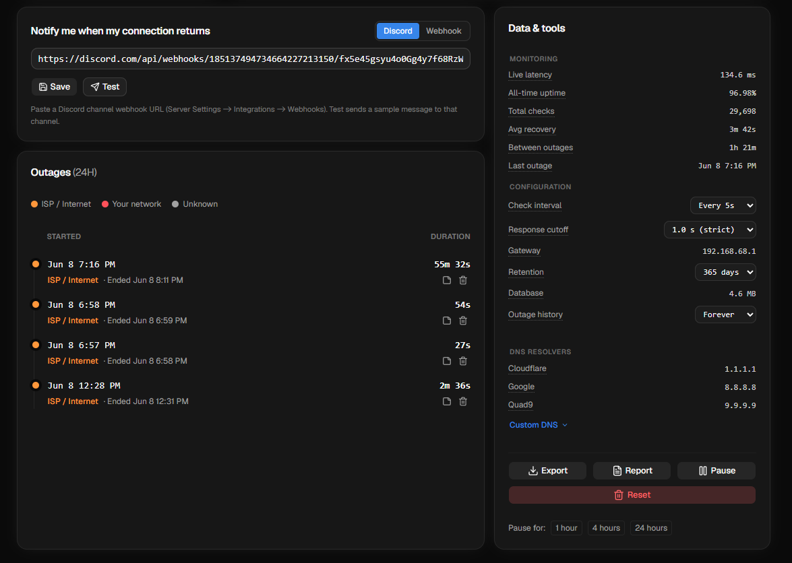
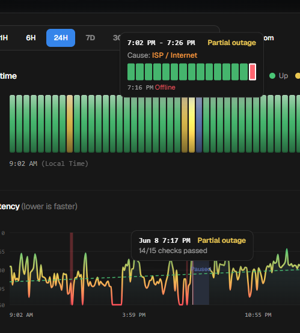

# Connection Watchman

A self-contained tool that runs 24/7 on an always-on machine, logs every internet
connectivity check to SQLite, and serves a live, mobile-friendly dashboard showing how
often, and why, your connection drops. Built for holding a flaky ISP accountable: every
outage is logged with its cause, duration, and exact timestamp, so you can back a support
ticket or refund claim with hard data instead of "it feels slow."

- **Zero dependencies.** Pure Python 3 standard library. Nothing to `pip install`.
- **Works offline.** The dashboard ships its own assets (no CDN), so it loads during an outage.
- **Survives reboots.** Runs as two auto-restarting services (systemd / launchd / Scheduled Tasks).

## Screenshots



*Availability gauge, uptime timeline, and latency chart for any range (1H through all-time, or a single day).*



*Recovery notifications, the per-range outage log, and the settings / export / pause tools.*



*Hover any point to see the cause, the up/down check breakdown, and latency for that moment.*

## Install

One command installs the monitor + dashboard as always-on services that start on boot.

**Linux / macOS:**

```bash
curl -fsSL https://raw.githubusercontent.com/noahbeanie/connection-watchman/main/install.sh | bash
```

**Windows** (admin PowerShell):

```powershell
irm https://raw.githubusercontent.com/noahbeanie/connection-watchman/main/install.ps1 | iex
```

The installer prints your dashboard URL. From other devices on the LAN use
`http://<hostname>.local:8080`. The port (8080, or the next free one) is fixed at install.

Requires Python 3 (present on macOS/Linux; the Windows installer fetches it via `winget`).
Uninstall with `uninstall.sh` / `uninstall.ps1`; your `uptime.db` is left in place.

The monitor only records while the host is awake. If the machine sleeps, that span shows as
grey "no data" (excluded from uptime, never counted as downtime) and resumes on wake, so run it
on a device that stays on for continuous coverage.

## How it works

Every interval (default 15s) the monitor runs a connectivity check and, separately, a DNS check.

**Connectivity** (the uptime score): TCP-connect to Cloudflare, Google, and Quad9 (`1.1.1.1`,
`8.8.8.8`, `9.9.9.9`) on ports 443 and 53. Up if any answers. A failed check is retried over a
few seconds before counting as down, so a single dropped packet is never an outage. A target
must also answer within the **response cutoff** (dashboard setting, default 1s), so a
reachable-but-crawling link counts as down. TCP-connect is used over ICMP because it needs no
root and isn't rate-limited. Latency is the connect that answered.

**DNS** is a separate signal that never affects uptime: resolve via the system resolver, then
fall back to public resolvers before declaring DNS down. Only checked while connectivity is up.

Each outage stores its exact start/end and a **cause**, found by probing the LAN gateway only
when connectivity fails:

| Cause | Meaning |
|-------|---------|
| `local`   | The router/LAN is unreachable: your equipment or this machine. |
| `isp`     | The router is fine, the internet isn't: your ISP / WAN. |
| `unknown` | Couldn't determine (e.g. gateway IP unknown). |

**Availability** = `(monitored - outage) / monitored`. Monitoring gaps (reboots, pauses, sleep)
count as neither up nor down, so they never inflate or deflate the number. Outage and DNS
history is exact, not bucket-estimated.

## Dashboard

- Radial **uptime gauge** for the selected range, graded Excellent to Poor.
- **Latency chart** with bands marking outages (red), no-data (grey), and paused (blue).
- **Status-page tracker**: per-slice up / partial / down / no-data; hover for cause and latency.
- **KPI tiles**: current uptime streak, downtime, outage count.
- **Outage log** for the range (paginated), with per-outage notes and delete.
- **Range presets** (1H through All) plus a custom date or single day.
- **Printable report** to hand to your ISP.
- **Data & tools**: DB size, check interval / retention / response cutoff, notifications, custom
  targets, CSV export, pause, and a guarded reset.

## Notifications (optional)

Under **Data & tools → Notify me when my connection returns**, add a webhook to get pinged when
the internet comes back, with the downtime and cause. (A recovery alert is always deliverable; a
"you're down now" alert can't be sent from a single box while it's offline.)

- **Discord**: a channel webhook URL.
- **Webhook**: any endpoint; receives `{"title", "message"}` as JSON.

Hit **Test** to send a sample.

## Custom targets (optional)

"Up" means any target answered. Defaults are Cloudflare / Google / Quad9 on ports 443 and 53.
Under **Data & tools → Targets**, swap in your own `host:port` list (e.g. to also watch a
specific service). Picked up within a cycle.

## Running alongside a VPN

An always-on VPN's policy routing can force the probe through the tunnel, so the monitor measures
the VPN path instead of your real link and misses outages your other devices see. To test the
**direct** path, set `UPTIME_FWMARK` to your VPN's bypass firewall mark so probe sockets skip the
tunnel (needs `CAP_NET_ADMIN`):

```bash
sudo mkdir -p /etc/systemd/system/uptime-monitor.service.d
printf '[Service]\nAmbientCapabilities=CAP_NET_ADMIN\nEnvironment=UPTIME_FWMARK=0xYOURMARK\n' \
  | sudo tee /etc/systemd/system/uptime-monitor.service.d/override.conf
sudo systemctl daemon-reload && sudo systemctl restart uptime-monitor
```

Find the mark with `ip rule show` (the `fwmark ... lookup <table>` rule your VPN adds). Your
other traffic stays on the VPN.

## Files

| File | What it does |
|------|--------------|
| `monitor.py`   | Logging daemon: probes, classifies causes, writes `uptime.db`. |
| `dashboard.py` | Web server: reads the DB, serves the dashboard + JSON API. |
| `web/`         | Built dashboard UI (bundled, offline-capable), served by `dashboard.py`. |
| `ui/`          | Dashboard UI source (Vite + React + TypeScript). |
| `install.sh` / `install.ps1` | Install the always-on services. |

## Storage

At the default interval the check log grows ~15 MB/month and plateaus under ~200 MB (old rows
trimmed hourly per the dashboard's retention setting). Outage and event history is kept forever.
